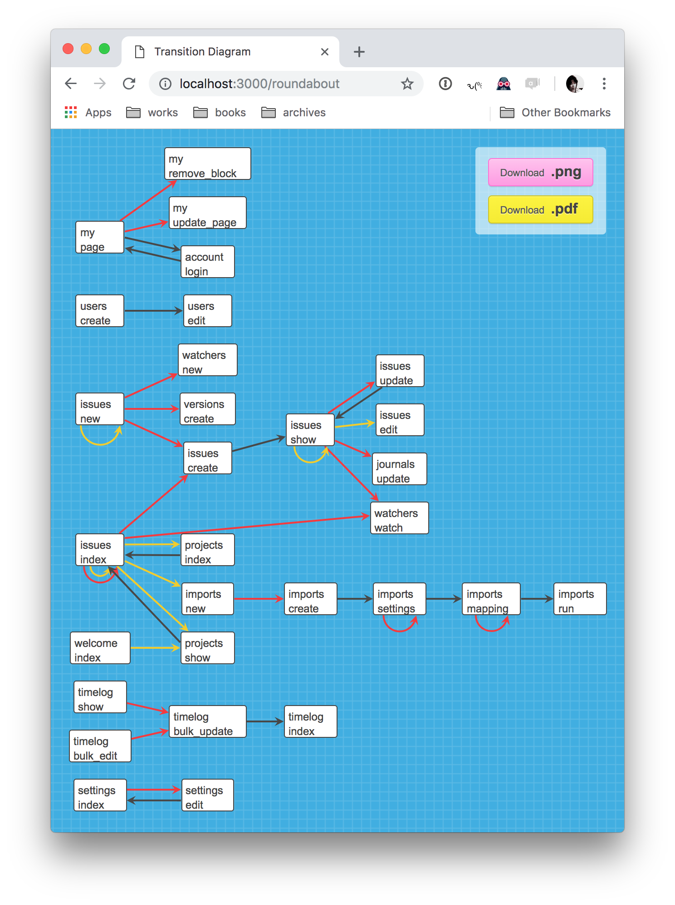

# Roundabout

A Rails Engine that generates and shows a page transition diagram for your Rails app from system tests.




## Requirements

- Ruby 2.x

- Rails 3 or newer

- RSpec / Minitest / TestUnit

- Capybara


## Installation

Bundle this gem to your Rails app's development and test env:

```ruby
  gem 'roundabout', group :development, :test
```


## Usage

Run the whole tests with `ROUNDABOUT` envvar (I suppose parallel spec is not supported ATM):

```bash
% ROUNDABOUT=1 rails test:system
```

All page transitions via capybara will be recorded, then woven into a diagram.

To see the generated diagram, just browse at your `http://localhost:3000/roundabout`.
You can also download a png image version and a PDF version from that page.


## Example

The image shown at the very top of this documentation was generated from [Redmine](https://github.com/redmine/redmine) project's codebase.


## Contributing

Send me a PR with a patch.


## Team

* [Akira Matsuda](https://github.com/amatsuda)
* [Teppei Machida](http://github.com/machida)
